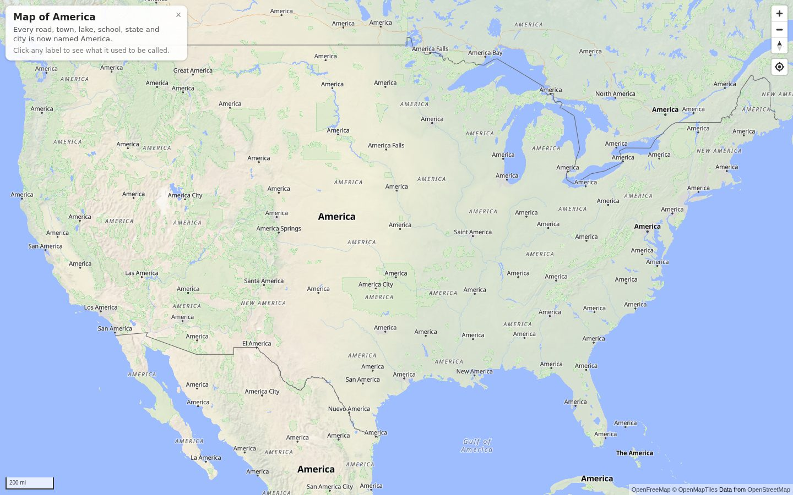
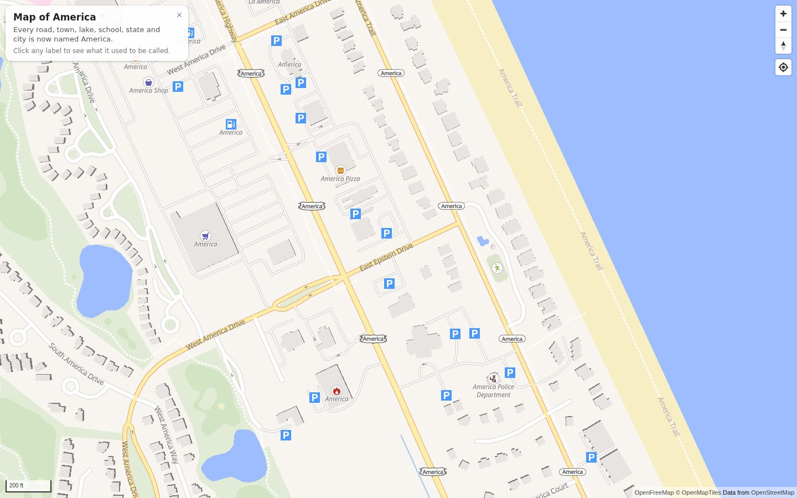

# Map of America

The Gulf of Mexico became the Gulf of America [Executive Order 14172, "Restoring Names That Honor American Greatness"; January 20, 2025]. Then Lake Ontario. Why stop there?

This is a full-screen map of the United States on which every road, street, town, city, state, country, lake, pond, river, ocean, park, school, airport, mountain and highway shield is named **America**. Carefully: Lake Ontario is Lake America, the Gulf of Mexico is the Gulf of America, New Mexico is New America, South Dakota is South America, and Greater Rochester International Airport is Greater America International Airport.

The one exception is anything named **Epstein**. Epstein Street in Sherman, Texas is still Epstein Street. Some things you can't rename.



Click any label to see what it used to be called.



## How it works

There is no build step, no server-side processing and no paid map plan.

- **Tiles** come from [OpenFreeMap](https://openfreemap.org), which serves OpenMapTiles-schema vector tiles built from OpenStreetMap, free, with no API key and no usage tier.
- **Rendering** is [MapLibre GL JS](https://maplibre.org), loaded from a CDN.
- **The rename** happens in the style, not the data. `america.js` fetches OpenFreeMap's Liberty style and wraps the `text-field` of every symbol layer in an expression that MapLibre evaluates per feature when it lays out labels in its worker:

  1. If the feature had no label (an unnamed service road, a bus stop, a road with no route number), it still has none.
  2. If any of its name fields contain "epstein", case-insensitively, the original label is kept.
  3. Otherwise the generic words are kept and the proper noun becomes "America". Expressions have no regular expressions, so this is done with a dictionary: take the longest known trailing phrase (" International Airport", " National Park", " Street"), then the longest known leading phrase of what is left ("Lake ", "Gulf of ", "New ", "Greater "), and put "America" in between. Whatever was in the middle, however many words, is gone. "West 56th Street" is "West America Street"; "Bank of Montreal" is "Bank of America"; "Broadway" is just "America". The lists live at the top of `america.js`.

  Highway shields get the same treatment. Since "America" is seven letters and Liberty picks shield sprites by the length of the route number, the shields are swapped for the widest sprite of each network and stretched sideways around the text.

- A few things are in the tiles but Liberty never labels them: parks, mountain peaks, and the majority of US airfields, which have no IATA code. Small label layers are added for those, tucked beneath the place names so a park can't crowd out a city. Liberty also only shows state names between zooms 5 and 8; here they show from 3 to 10, since the states are the headline. Denali is America too.

The tiles themselves are untouched. Clicking a label reads the feature's original properties straight from the tile, which is how the "formerly" popup works.

## Running it

It's a static page. Any web server will do:

```sh
npm start            # serves the folder at http://127.0.0.1:8000/
```

or `python3 -m http.server`, or open `index.html` directly. Everything it loads is remote, so it works from a file URL as well.

To publish it, turn on GitHub Pages for this repository (Settings, Pages, deploy from a branch, root folder). There is nothing to compile.

## Domain

The site lives at [mapofamerica.wtf](https://mapofamerica.wtf). The `CNAME` file in the repository root tells GitHub Pages the domain; the DNS side is:

| Name  | Type          | Value                  |
| ----- | ------------- | ---------------------- |
| `@`   | ALIAS / ANAME | `ryantenney.github.io` |
| `www` | CNAME         | `ryantenney.github.io` |

An ALIAS (or ANAME, or a flattened CNAME on Cloudflare) resolves GitHub's current addresses at query time, so there are no IP addresses to keep up to date. If the DNS host has no such record type, use four A records instead: `185.199.108.153`, `185.199.109.153`, `185.199.110.153`, `185.199.111.153`.

GitHub redirects `www` to the bare domain. Once the records resolve, tick "Enforce HTTPS" in the Pages settings.

## Tests

```sh
npm install
npm test
```

Node 22 or newer. The tests compile the rewritten expressions with MapLibre's own `@maplibre/maplibre-gl-style-spec` package and evaluate them, filters included, against synthetic features and against two real OpenFreeMap tiles checked in as fixtures: Midtown Manhattan (every one of thousands of labels becomes America; unnamed features stay unlabelled) and Nags Head, North Carolina (East Epstein Drive and East Epstein Street keep their names). They also check that the transformed style validates against the style spec, that nothing but labels changed on Liberty's layers, that shield sprites exist, and that legacy `{token}` text fields are handled.

OpenFreeMap serves its style and sprite unversioned, so `npm run check-upstream` fetches the live versions and confirms the shield layers are still recognised and every sprite image this page relies on still exists. Add `--update` to refresh the fixtures from the live files.

`npm run screenshot` renders a few views into `docs/` with headless Chromium. It needs a browser (`npx playwright install chromium`, or point `CHROME_PATH` at one).

## Options

`America.americanize(style, options)` returns a new style and leaves the input alone.

| option   | default       | meaning                                                          |
| -------- | ------------- | ---------------------------------------------------------------- |
| `name`   | `"America"`   | what everything is called now                                    |
| `keep`   | `["Epstein"]` | case-insensitive substrings; matching features keep their names  |
| `extras` | `true`        | label parks, peaks and airfields too, and show states longer     |
| `careful` | `true`       | keep generic words; `false` renames every label to just `name`  |

`America.labelLayerIds(style)`, `America.labelFields(style)`, `America.originalName(properties, fields)`, `America.labelFor(properties, fields)` and `America.isKept(properties)` are the helpers the page uses for click handling; `America.rename(text)` applies the dictionary to one string.

## Using a different base map

`STYLE_URL` in `index.html` can point at any MapLibre style whose tiles carry OpenMapTiles-style name fields (`name`, `name:latin`, `name_en`, `ref`). OpenFreeMap's `bright` and `positron` styles work as-is, as does a self-hosted OpenMapTiles or Planetiler build. Styles with other schemas will still get renamed, since the rewrite only cares about the label text, but the shield handling assumes Liberty's sprites.

## Credits

- Map data © [OpenStreetMap](https://www.openstreetmap.org/copyright) contributors, available under the Open Database License. The two tile fixtures under `test/` are derived from OpenStreetMap data.
- Tiles and hosting by [OpenFreeMap](https://openfreemap.org); schema by [OpenMapTiles](https://openmaptiles.org).
- Base style: [OSM Liberty](https://github.com/maputnik/osm-liberty) (BSD 3-Clause), as adapted by OpenFreeMap.
- Renderer: [MapLibre GL JS](https://github.com/maplibre/maplibre-gl-js) (BSD 3-Clause).
- Shaded relief: [Natural Earth](https://www.naturalearthdata.com) (public domain).

Author: Ryan Tenney
